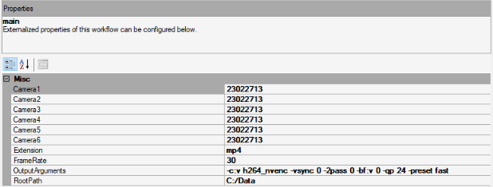

# hexa-flir-demo

Demo on how to acquire from multiple FLIR cameras using bonsai and encoding using FFMPEG

## Deployment

To deploy the Bonsai code, run `./bonsai/setup.cmd`. This small script will download and regenerate the current bonsai environment ([see tutorial for further details.](https://bonsai-rx.org/docs/articles/environments.html))

---

## Prerequisites

These should only need to be installed once on a fresh new system, and are not required if simply refreshing the install or deploying to a new folder.

- Windows 10 or 11
- [Visual Studio Code](https://code.visualstudio.com/) (highly recommended for editing code scripts and git commits)
- [Git for Windows](https://gitforwindows.org/) (highly recommended for cloning and manipulating this repository)
- [.NET Framework 4.7.2 Developer Pack](https://dotnet.microsoft.com/download/dotnet-framework/thank-you/net472-developer-pack-offline-installer) (required for intellisense when editing code scripts)
- [Visual C++ Redistributable for Visual Studio 2012](https://www.microsoft.com/en-us/download/details.aspx?id=30679) (native dependency for OpenCV)
- [Spinnaker SDK 1.29.0.5](https://www.flir.co.uk/support/products/spinnaker-sdk/#Downloads) (device drivers for FLIR cameras)
  - On FLIR website: `Download > archive > 1.29.0.5 > SpinnakerSDK_FULL_1.29.0.5_x64.exe`
- [FFMPEG with libx264](https://www.gyan.dev/ffmpeg/builds/) (required for encoding video)
  - Extract the zip file to `C:\ffmpeg`
  - Add `C:\ffmpeg\bin` to the system `PATH` environment variable
  - If you need to unlock the maximum number of simultaneous nvenc encoding sessions [follow these instructions](https://github.com/keylase/nvidia-patch/wiki/Verify-NVENC-patch)

---

## Quick start

  - Open Bonsai (`./bonsai/Bonsai.exe`)
  - Open the workflow (`./src/main.bonsai`)
  - Define the relevant properties in the property grid on the right:

- `Camera<X>`: The serial number of the camera to instantiate (dropdown list)
- `Extension`: The file extension to use for the output video file (e.g. `.mp4`)
- `FrameRate`: The frame rate to use for the output video file (e.g. `30`)
- `OutpuArguments`: The output arguments to use for the output video file encoding (e.g. `-crf 23 -preset fast`)
- `RootPath`: The root path to use for the output video file (e.g. `C:\Data`). Data will be saved in the format: `<RootPath>\<Date>\<CameraSerial>.<Extension>`

  - Click the `Start` button in the top left corner of the bonsai window
  - For each camera two files will be logged. The video and the metadata.